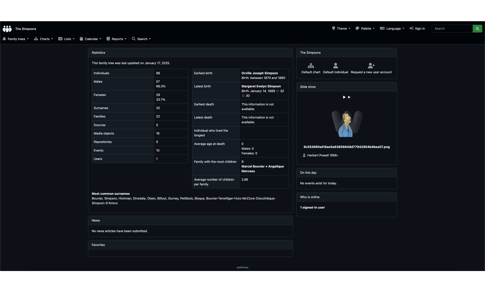
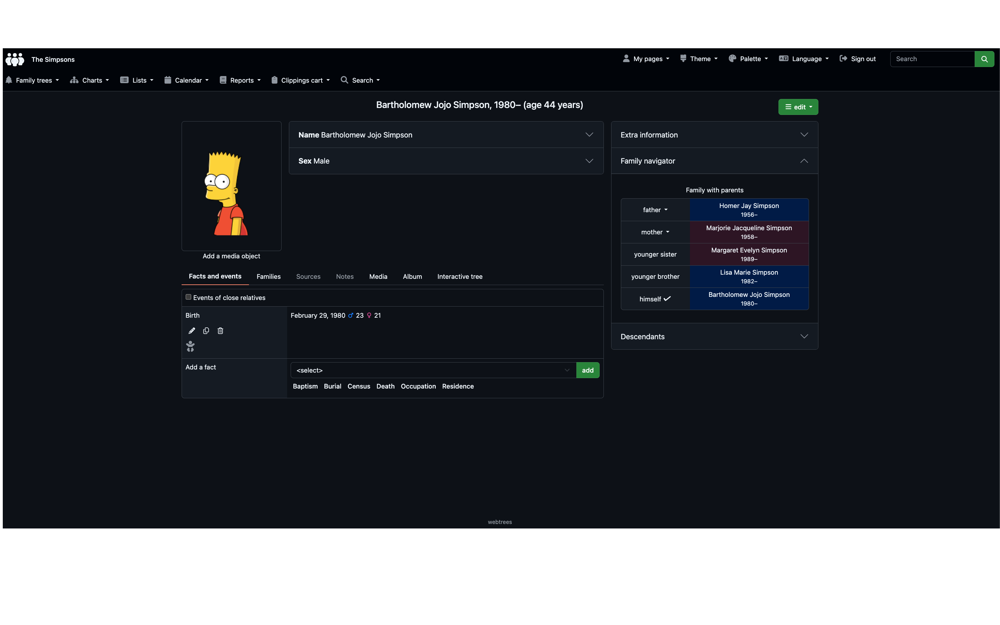

:::info

[Webtrees](https://webtrees.net/) is a powerful, open-source genealogy application designed for managing and sharing family history. 

Built around the [GEDCOM](https://en.wikipedia.org/wiki/GEDCOM) standard for genealogical data exchange, Webtrees allows users to maintain a detailed family tree in a web-based environment, accessible from anywhere. Its modular design supports advanced features - like multimedia file management, privacy controls, and customizable reports - making it suitable for hobbyists and professional genealogists alike.

With its collaborative capabilities, Webtrees enables multiple users to contribute to the same tree, fostering a dynamic and interactive exploration of ancestry. Whether you're digitalizing your family records, exploring your lineage, or creating an interactive archive for future generations, Webtrees combines flexibiliy, scalability, and user-friendly tools to bring your family history to life.

:::

---

# User Guide
:::note

Throughout this guide, we'll be using the popular [Simpsons](https://en.wikipedia.org/wiki/The_Simpsons) family for examples.

:::

## Home Page

> This is the main home page, when accessing the site.

## User Screen

