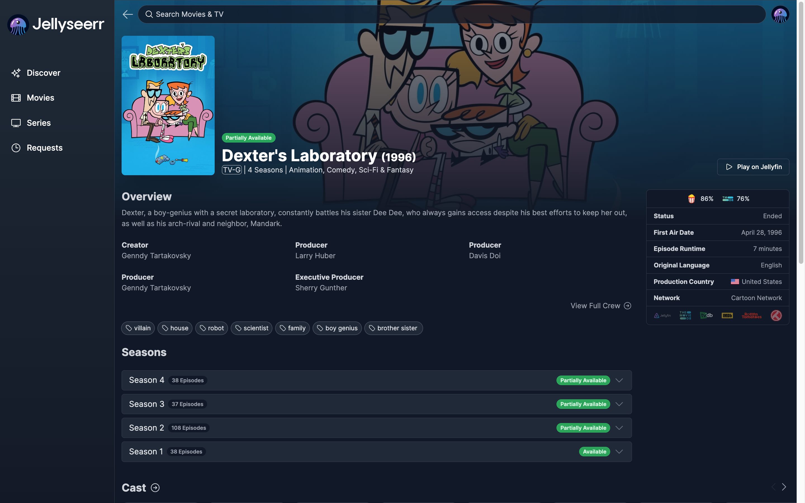
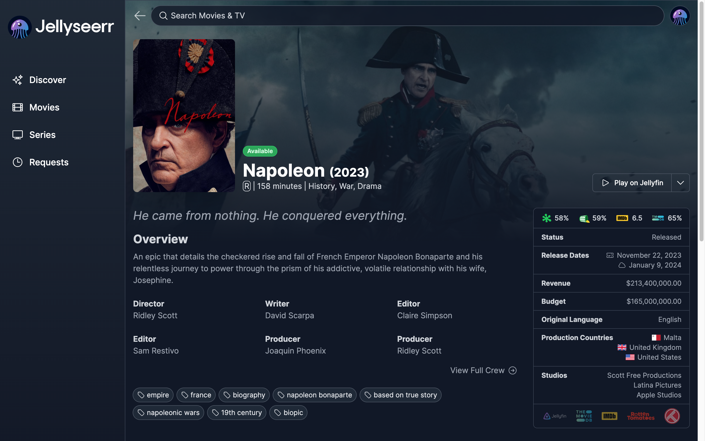
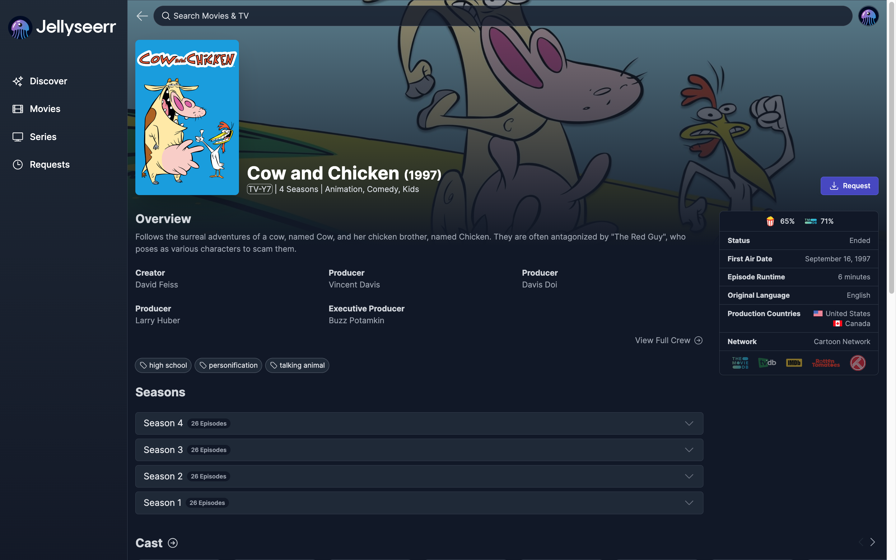
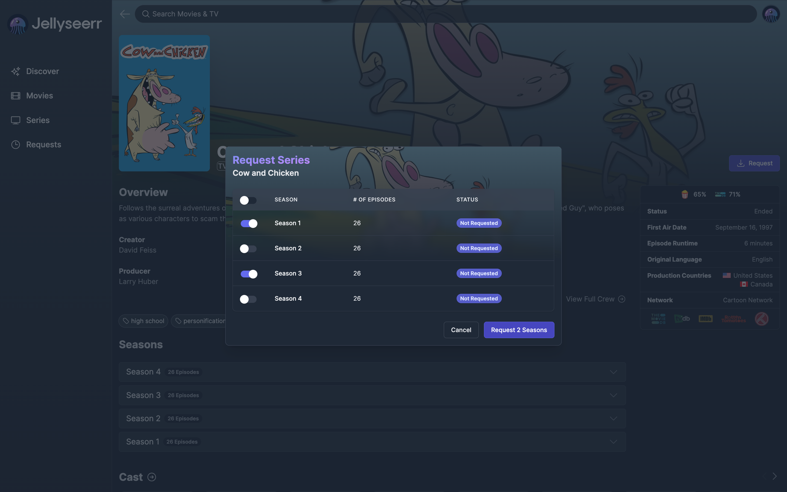
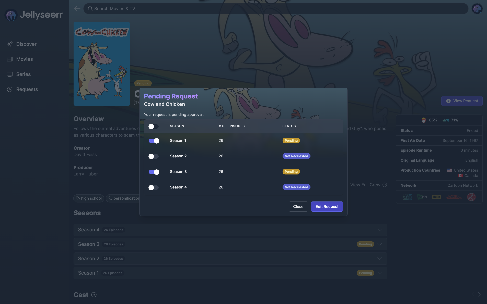
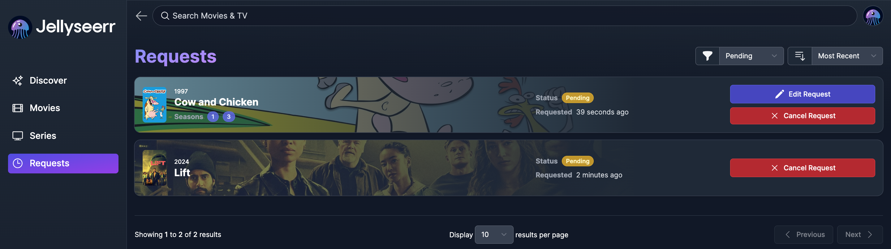
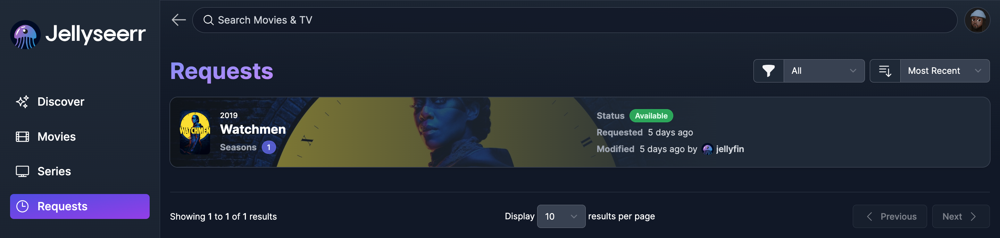
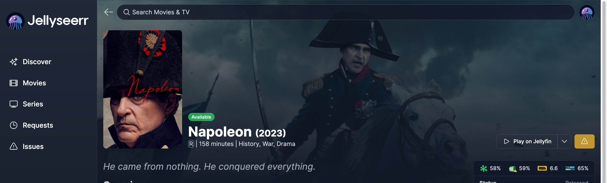
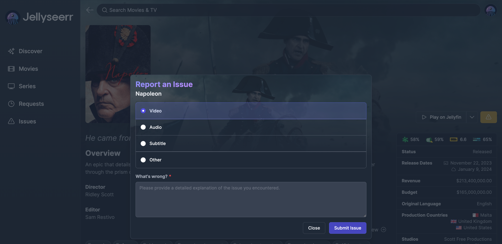

# Summary
> **Jellyseerr** is a free and open-source application to manage the tracking of media requests.
This allows you to:
> 
> - [request any media (movies or tv shows)](jellyseerr-user-guide#Requesting%20content)
> - [search for new (hopefully interesting) content](jellyseerr-user-guide#Searching%20for%20content)
> - view pending (and completed) requests
> - [report issues with content](jellyseer-user-guide#Reporting%20issues)

All of this gets funneled to me via push notification to take action (e.g. investigating streaming errors). This will simplify management of the media server as the content grows.

# Getting Started

>[!important]
>You will sign in with the same credentials you use on Jellyfin.

> Main login screen.

## Home Page

> Content with a green checkmark are available in Jellyfin. 
> Content with a white line in a green circle are partially available in Jellyfin.

---

**Below are examples of content with available and partially available statuses.**

> A TV show that is partially available. Season 1 is ***fully** available*, while Seasons 2-4 are ***partially** available*.

> A movie that is ***fully** available*.

---
## Searching for content

You can navigate to any of the following screens to search for content: *Discover*, *Movies*, *Series*.

- The application allows you to apply various filters to find new content.

>View of the search filters.
>Some options include: *Studio*, *Streaming Service*, *Keywords,* etc.

---
## Requesting content
### TV Shows

1. Click the *Request* button on the right-side.

> Main page of a TV show that is unavailable. Notice the *Request* option to the right.

2. Select the seasons you would like.
    
    
    > Series request selection screen.    

    
    > Pending request of TV show.
    
    ---
### Movies
1. The same process applies to requesting movies.

> A movie before *and* after request. 

2. You can view your pending/completed media requests.

> View of the **pending** requests on the *Requests* page.

> View of an **available** request on the *Requests* page.

    
---
## Reporting Issues

1. Navigate to the content that was giving issue on Jellyfin.

> View of a movie. Notice the yellow-hazard symbol on the right-side.

2. Select the hazard symbol on the right-hand side.
3. Choose the type of issue that you would like to report. Also include a brief description of the issue.
> [!tip]
> TV shows will allow you to select the seasons you were having issues with. If there was a particular episode you would like to mention, include it in the comment box.

> View of the Issue Reporting screen.